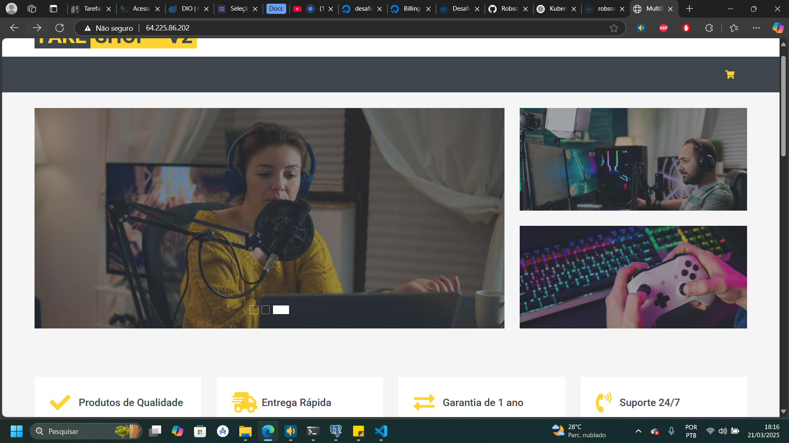
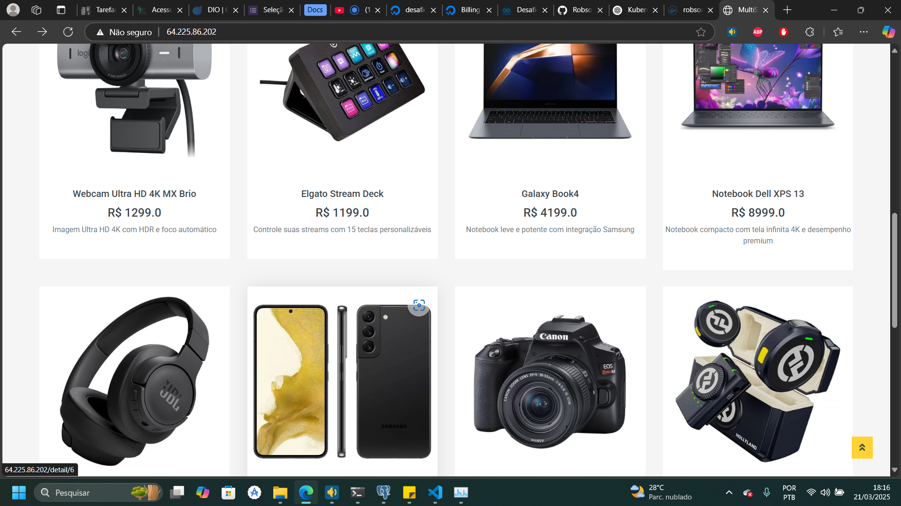
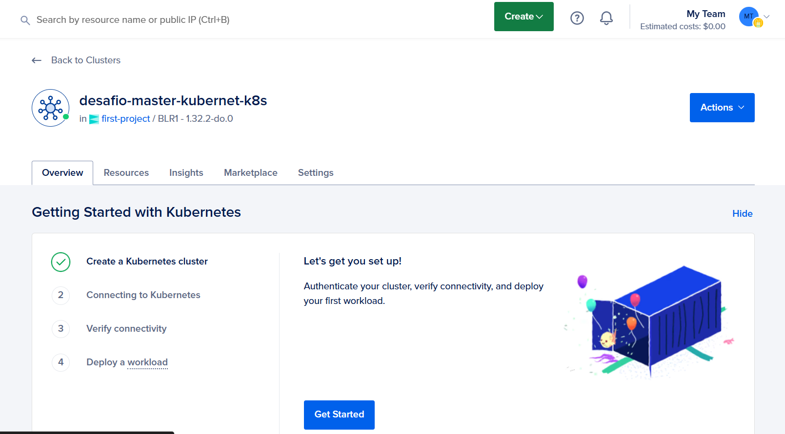
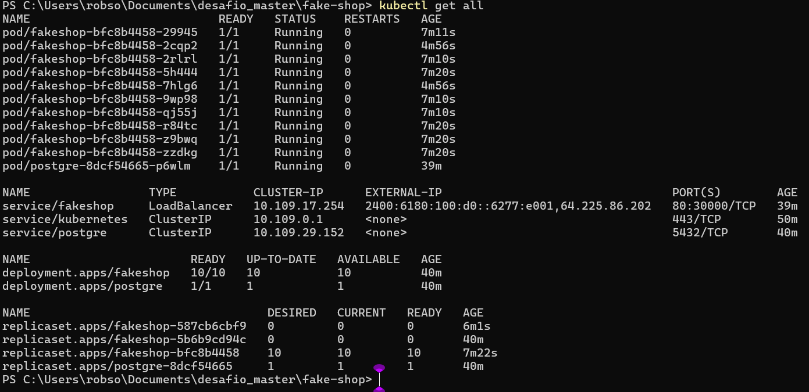

# Fake Shop

## Sistema de Gerenciamento de Produtos e Vendas

Este projeto consiste em um sistema de gerenciamento de produtos e vendas utilizando **Docker** e **Kubernetes**. O ambiente conta com balanceamento de carga, serviços e deploy automatizado, além de gerenciamento de versões e rollback. A **DigitalOcean** foi utilizada como provedor de nuvem para a hospedagem e gerenciamento do cluster Kubernetes.

---

## Descrição
### Aplicação

### Cluster Kubernetes na DigitalOcean

### IP, Nodes e Pods criados no Kubernetes

---

## Variáveis de Ambiente

Para configurar o ambiente corretamente, defina as seguintes variáveis:

| Variável        | Descrição |
|----------------|-----------|
| `DB_HOST`      | Host do banco de dados PostgreSQL. |
| `DB_USER`      | Nome do usuário do banco de dados PostgreSQL. |
| `DB_PASSWORD`  | Senha do usuário do banco de dados PostgreSQL. |
| `DB_NAME`      | Nome do banco de dados PostgreSQL. |
| `DB_PORT`      | Porta de conexão com o banco de dados PostgreSQL. |

---

## Tecnologias Utilizadas
- **Docker** para containerização dos serviços.
- **Kubernetes** para orquestração dos contêineres.
- **PostgreSQL** como banco de dados.
- **DigitalOcean** como provedor de infraestrutura.
- **Load Balancer** para distribuir o tráfego entre os pods.

Este projeto oferece uma solução escalável e confiável para gerenciamento de produtos e vendas, facilitando a implantação e o gerenciamento contínuo da aplicação.

